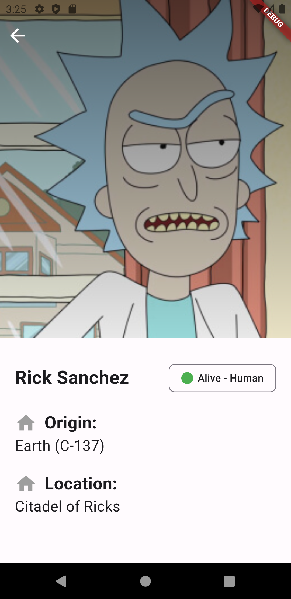

**README**

**Flutter 3.13.5**

Este proyecto es una demostración de cómo crear una aplicación Flutter usando una arquitectura limpia, Bloc, Equatable, y otros patrones y principios de diseño.

## Instalación

1. Instala Flutter siguiendo las instrucciones de la documentación oficial: https://flutter.dev/docs/get-started/install.
2. Clona este repositorio:

```
git clone https://github.com/carrizomiguel/rick_and_morty_flutter.git
```

3. Dirígete a la carpeta del proyecto:

```
cd rick_and_morty_flutter
```

4. Instala las dependencias:

```
flutter pub get
```

## Ejecución

Para ejecutar la aplicación en modo desarrollo:

```
flutter run
```

Para ejecutar la aplicación en modo de producción:

```
flutter build apk
```

## Screenshots

  
 

## Arquitectura

### Project Folder Structure
```
├── lib/
|   ├── core/
|   |   ├── network/
|   │   ├── app/
│   │   │   ├── presentation/
│   │   │   └── app.dart
|   |   └── error/
│   ├── features/
│   │   ├── feature1/
│   │   │   ├── presentation/
│   │   │   │   ├── bloc/
│   │   │   │   ├── pages/
│   │   │   │   └── widgets/
│   │   │   └── feature1.dart
│   │   ├── feature2/
│   │   │   ├── featureA/
│   │   │   └── featureB/
│   │   └── feature3/
│   │       ├── presentation/
│   │       └── feature3.dart
|   ├── bootstrap.dart
│   └── main.dart
├── packages/
|   ├── package1/
│   └── package2/
├── pubspec.yaml
└── README.md
```
## Patrones y principios de diseño

La aplicación utiliza los siguientes patrones y principios de diseño:

* **Bloc:** Este patrón de diseño ayuda a separar la lógica de la interfaz de usuario de la lógica empresarial.
* **Equatable:** Este mixin ayuda a comparar objetos de forma eficiente.
* **Clean architecture:** Este patrón de arquitectura ayuda a diseñar aplicaciones modulares y mantenibles.

## Otros

La aplicación también utiliza las siguientes bibliotecas y herramientas:

* **Dart:** Este lenguaje de programación se utiliza para desarrollar aplicaciones Flutter.
* **Flutter:** Este SDK se utiliza para crear aplicaciones móviles, web y de escritorio con Dart.
* **Flutter DevTools:** Este conjunto de herramientas ayuda a depurar y perfilar aplicaciones Flutter.
